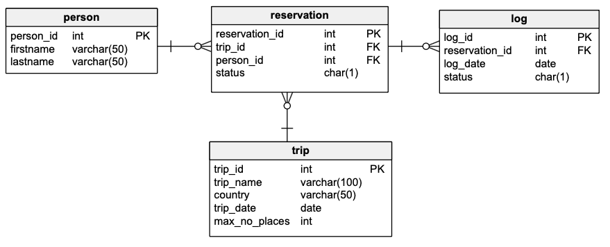

# Oracle PL/Sql

widoki, funkcje, procedury, triggery
ćwiczenie

---

Imiona i nazwiska autorów : Hubert Myszka, Michał Nowak

---

# Tabele



- `Trip` - wycieczki
  - `trip_id` - identyfikator, klucz główny
  - `trip_name` - nazwa wycieczki
  - `country` - nazwa kraju
  - `trip_date` - data
  - `max_no_places` - maksymalna liczba miejsc na wycieczkę
- `Person` - osoby
  - `person_id` - identyfikator, klucz główny
  - `firstname` - imię
  - `lastname` - nazwisko

- `Reservation` - rezerwacje/bilety na wycieczkę
  - `reservation_id` - identyfikator, klucz główny
  - `trip_id` - identyfikator wycieczki
  - `person_id` - identyfikator osoby
  - `status` - status rezerwacji
    - `N` – New - Nowa
    - `P` – Confirmed and Paid – Potwierdzona  i zapłacona
    - `C` – Canceled - Anulowana
- `Log` - dziennik zmian statusów rezerwacji
  - `log_id` - identyfikator, klucz główny
  - `reservation_id` - identyfikator rezerwacji
  - `log_date` - data zmiany
  - `status` - status

```sql
create sequence s_person_seq
   start with 1
   increment by 1;

create table person
(
  person_id int not null
      constraint pk_person
         primary key,
  firstname varchar(50),
  lastname varchar(50)
)

alter table person
    modify person_id int default s_person_seq.nextval;

```

```sql
create sequence s_trip_seq
   start with 1
   increment by 1;

create table trip
(
  trip_id int  not null
     constraint pk_trip
         primary key,
  trip_name varchar(100),
  country varchar(50),
  trip_date date,
  max_no_places int
);

alter table trip
    modify trip_id int default s_trip_seq.nextval;
```

```sql
create sequence s_reservation_seq
   start with 1
   increment by 1;

create table reservation
(
  reservation_id int not null
      constraint pk_reservation
         primary key,
  trip_id int,
  person_id int,
  status char(1)
);

alter table reservation
    modify reservation_id int default s_reservation_seq.nextval;


alter table reservation
add constraint reservation_fk1 foreign key
( person_id ) references person ( person_id );

alter table reservation
add constraint reservation_fk2 foreign key
( trip_id ) references trip ( trip_id );

alter table reservation
add constraint reservation_chk1 check
(status in ('N','P','C'));

```

```sql
create sequence s_log_seq
   start with 1
   increment by 1;


create table log
(
    log_id int not null
         constraint pk_log
         primary key,
    reservation_id int not null,
    log_date date not null,
    status char(1)
);

alter table log
    modify log_id int default s_log_seq.nextval;

alter table log
add constraint log_chk1 check
(status in ('N','P','C')) enable;

alter table log
add constraint log_fk1 foreign key
( reservation_id ) references reservation ( reservation_id );
```

---

# Dane

Należy wypełnić tabele przykładowymi danymi

- 4 wycieczki
- 10 osób
- 10 rezerwacji

Dane testowe powinny być różnorodne (wycieczki w przyszłości, wycieczki w przeszłości, rezerwacje o różnym statusie itp.) tak, żeby umożliwić testowanie napisanych procedur.

W razie potrzeby należy zmodyfikować dane tak żeby przetestować różne przypadki.

```sql
-- trip
insert into trip(trip_name, country, trip_date, max_no_places)
values ('Wycieczka do Paryza', 'Francja', to_date('2023-09-12', 'YYYY-MM-DD'), 3);

insert into trip(trip_name, country, trip_date,  max_no_places)
values ('Piekny Krakow', 'Polska', to_date('2025-05-03','YYYY-MM-DD'), 2);

insert into trip(trip_name, country, trip_date,  max_no_places)
values ('Znow do Francji', 'Francja', to_date('2025-05-01','YYYY-MM-DD'), 2);

insert into trip(trip_name, country, trip_date,  max_no_places)
values ('Hel', 'Polska', to_date('2025-05-01','YYYY-MM-DD'),  2);

-- person
insert into person(firstname, lastname)
values ('Jan', 'Nowak');

insert into person(firstname, lastname)
values ('Jan', 'Kowalski');

insert into person(firstname, lastname)
values ('Jan', 'Nowakowski');

insert into person(firstname, lastname)
values  ('Novak', 'Nowak');

-- reservation
-- trip1
insert  into reservation(trip_id, person_id, status)
values (1, 1, 'P');

insert into reservation(trip_id, person_id, status)
values (1, 2, 'N');

-- trip 2
insert into reservation(trip_id, person_id, status)
values (2, 1, 'P');

insert into reservation(trip_id, person_id, status)
values (2, 4, 'C');

-- trip 3
insert into reservation(trip_id, person_id, status)
values (2, 4, 'P');
```

proszę pamiętać o zatwierdzeniu transakcji

---

# Zadanie 0 - modyfikacja danych, transakcje

Należy przeprowadzić kilka eksperymentów związanych ze wstawianiem, modyfikacją i usuwaniem danych
oraz wykorzystaniem transakcji

Skomentuj dzialanie transakcji. Jak działa polecenie `commit`, `rollback`?.
Co się dzieje w przypadku wystąpienia błędów podczas wykonywania transakcji? Porównaj sposób programowania operacji wykorzystujących transakcje w Oracle PL/SQL ze znanym ci systemem/językiem MS Sqlserver T-SQL

pomocne mogą być materiały dostępne tu:
https://upel.agh.edu.pl/mod/folder/view.php?id=411834
w szczególności dokumenty: `10_modyf_ora_north.pdf`, `20_ora_plsql_north.pdf`

```sql
-- Dodajemy nowego prowadzącego i jakiegoś studenta, oraz dzięki poleceniu COMMIT zapisujemy fizycznie do bazy danych nasze nowe osoby, chciałem dodać jeszcze kolejną osobę, ale mój kolega stwierdził, że to zły pomysł i kazał mi to poprawić więc użyłem ROLLBACK, aby cofnąć wykonaną transakcję insert. ROLLBACK cofa działanie wszystkich transakcji do momentu ostatniego COMMIT.

SET TRANSACTION READ WRITE NAME 'add_people';

insert into PERSON (FIRSTNAME, LASTNAME)
values ('Marcin', 'Kuta');

insert into PERSON (FIRSTNAME, LASTNAME)
values ('Student', 'Debil');

COMMIT;

SET TRANSACTION WRITE NAME 'add_zbigniew_stonoga';

insert into PERSON (FIRSTNAME, LASTNAME)
values ('Zbigniew', 'Stonoga');

ROLLBACK;

-- Wynik:
-- 11,Marcin,Kuta
-- 12,Student,Debil

-------------

-- Jako, że w naszej bazie danych znajdują się sami prowadzący zajęcia, to pozbywamy się naszego studenta dzięki "delete" i zatwierdzamy

SET TRANSACTION READ WRITE NAME 'delete_student'

delete from PERSON
where FIRSTNAME = 'Student'
and LASTNAME = 'Debil';

COMMIT;

-- Efektem jest pozbycie się wiersza:
-- 12,Student,Debil

-------------

-- Dodajemy w takim razie nowego prowadzącego i zatwierdzamy

SET TRANSACTION READ ONLY NAME 'insert_zbigniew_kakol';

insert into PERSON (FIRSTNAME, LASTNAME)
values ('Zbigniew', 'Kąkol');

COMMIT;

-- Po uruchomieniu tej transakcji wyskoczył błąd:
```


```sql
-- Od razu widać, że problem jest w tym, że chciałem nadać transakcji uprawnienia READ ONLY, a powinna być ona READ WRITE, dlatego szybko to poprawiamy i lecimy dalej.

SET TRANSACTION READ WRITE NAME 'insert_zbigniew_kakol';

insert into PERSON (FIRSTNAME, LASTNAME)
values ('Zbigniew', 'Kąkol');

COMMIT;

-- Wynik:
-- 14,Zbigniew,Kąkol

-------------

-- Widać, że teraz "zepsuła" nam się inkrementacja PERSON_ID, więc chcemy to naprawić. Jako, że Marcin Kuta ma ID = 11, to Zbigniew Kąkol pownien mieć ID = 12 (chcemy to zrobić w bezpieczny sposób więc użyjemy bloku begin, ... end; i sprawdzimy poprawność akcji dzięki dbms_output), jeśli będziemy chcieli dodać nowego prowadzącego to kolejne ID powinno wynosić 13. Naprawiamy to w ten sposób:

SET TRANSACTION READ WRITE NAME 'fix_person_id_&_update_person_id_sequence'

set serveroutput on  -- aby zadziałał dbms_output, ale datagrip jest na tyle upierdliwy, że trzeba było to jeszcze zmienić w ustawieniach konsoli

begin
    update PERSON
    set PERSON_ID = 12
    where FIRSTNAME = 'Zbigniew'
    and LASTNAME = 'Kąkol';

    dbms_output.PUT_LINE('OK');
end;

-- Wynik:
-- 12,Zbigniew,Kąkol

-- Naprawiliśmy już ID Zbigniewa Kąkola więc teraz czas naprawić sekwencję, robimy to poprzez:

alter sequence S_PERSON_SEQ
restart start with 13;

COMMIT;

-- Dodajemy więc nowego prowadzącego, aby sprawdzić, czy rzeczywiście wszystko działa:

SET TRANSACTION READ WRITE NAME 'add_leszek_kotulski'

insert into PERSON(FIRSTNAME, LASTNAME)
values ('Leszek', 'Kotulski');

COMMIT;

-- Wynik:
-- 13,Leszek,Kotulski

```

---

# Zadanie 1 - widoki

Tworzenie widoków. Należy przygotować kilka widoków ułatwiających dostęp do danych. Należy zwrócić uwagę na strukturę kodu (należy unikać powielania kodu)

Widoki:

- `vw_reservation`
  - widok łączy dane z tabel: `trip`, `person`, `reservation`
  - zwracane dane: `reservation_id`, `country`, `trip_date`, `trip_name`, `firstname`, `lastname`, `status`, `trip_id`, `person_id`
- `vw_trip`
  - widok pokazuje liczbę wolnych miejsc na każdą wycieczkę
  - zwracane dane: `trip_id`, `country`, `trip_date`, `trip_name`, `max_no_places`, `no_available_places` (liczba wolnych miejsc)
- `vw_available_trip`
  - podobnie jak w poprzednim punkcie, z tym że widok pokazuje jedynie dostępne wycieczki (takie które są w przyszłości i są na nie wolne miejsca)

Proponowany zestaw widoków można rozbudować wedle uznania/potrzeb

- np. można dodać nowe/pomocnicze widoki, funkcje
- np. można zmienić def. widoków, dodając nowe/potrzebne pola

# Zadanie 1 - rozwiązanie

```sql

--vw_reservation
CREATE OR REPLACE VIEW vw_reservation
AS
SELECT RESERVATION_ID , T.COUNTRY,T.trip_date, T.trip_name, P.firstname, P.lastname, status, R.trip_id, R.person_id
FROM RESERVATION R
INNER JOIN TRIP T ON R.TRIP_ID=T.TRIP_ID
INNER JOIN PERSON P ON R.PERSON_ID=P.PERSON_ID

--vw_trip
CREATE OR REPLACE VIEW vw_trip
AS
SELECT T.TRIP_ID, T.country, T.trip_date, T.trip_name, T.max_no_places, T.MAX_NO_PLACES-(SELECT COUNT(*)
FROM RESERVATION
WHERE TRIP_ID=T.TRIP_ID AND STATUS = 'P') as REMAINING_PLACES
FROM TRIP T

--vw_available_trip
CREATE OR REPLACE VIEW vw_available
AS
SELECT * FROM vw_trip
WHERE REMAINING_PLACES > 0

```

---

# Zadanie 2 - funkcje

Tworzenie funkcji pobierających dane/tabele. Podobnie jak w poprzednim przykładzie należy przygotować kilka funkcji ułatwiających dostęp do danych

Procedury:

- `f_trip_participants`
  - zadaniem funkcji jest zwrócenie listy uczestników wskazanej wycieczki
  - parametry funkcji: `trip_id`
  - funkcja zwraca podobny zestaw danych jak widok `vw_eservation`
- `f_person_reservations`
  - zadaniem funkcji jest zwrócenie listy rezerwacji danej osoby
  - parametry funkcji: `person_id`
  - funkcja zwraca podobny zestaw danych jak widok `vw_reservation`
- `f_available_trips_to`
  - zadaniem funkcji jest zwrócenie listy wycieczek do wskazanego kraju, dostępnych w zadanym okresie czasu (od `date_from` do `date_to`)
    - dostępnych czyli takich na które są wolne miejsca
  - parametry funkcji: `country`, `date_from`, `date_to`

Funkcje powinny zwracać tabelę/zbiór wynikowy. Należy rozważyć dodanie kontroli parametrów, (np. jeśli parametrem jest `trip_id` to można sprawdzić czy taka wycieczka istnieje). Podobnie jak w przypadku widoków należy zwrócić uwagę na strukturę kodu

Czy kontrola parametrów w przypadku funkcji ma sens?

- jakie są zalety/wady takiego rozwiązania?

Proponowany zestaw funkcji można rozbudować wedle uznania/potrzeb

- np. można dodać nowe/pomocnicze funkcje/procedury

# Zadanie 2 - rozwiązanie

```sql


-- f_available_trips_to

create or replace type available_trip as OBJECT
(
trip_id int,
trip_name varchar(100),
trip_date date,
remaining_places int
);

create or replace type available_trip_table is table of available_trip;

create or replace function f_available_trips_to(destination_country varchar, date_from date, date_to date)
    return available_trip_table
as
    result available_trip_table:= available_trip_table();
begin
    select available_trip(tr.trip_id,tr.trip_name,tr.trip_date,tr.remaining_places)
    bulk collect
    into result
    from vw_trip tr
    where tr.country=destination_country and tr.trip_date between date_from and date_to;
    return result;
end;

--testy

--select trip_id,trip_name,trip_date,remaining_places from table(f_available_trips_to ('Poland','1980-01-01','2025-12-12'));

```

---

# Zadanie 3 - procedury

Tworzenie procedur modyfikujących dane. Należy przygotować zestaw procedur pozwalających na modyfikację danych oraz kontrolę poprawności ich wprowadzania

Procedury

- `p_add_reservation`
  - zadaniem procedury jest dopisanie nowej rezerwacji
  - parametry: `trip_id`, `person_id`
  - procedura powinna kontrolować czy wycieczka jeszcze się nie odbyła, i czy sa wolne miejsca
  - procedura powinna również dopisywać inf. do tabeli `log`
- `p_modify_reservation_status`
  - zadaniem procedury jest zmiana statusu rezerwacji
  - parametry: `reservation_id`, `status`
  - dopuszczalne są wszystkie zmiany statusu
    - ale procedura powinna kontrolować czy taka zmiana jest możliwa, np. zmiana statusu już anulowanej wycieczki (przywrócenie do stanu aktywnego nie zawsze jest możliwa – może już nie być miejsc)
  - procedura powinna również dopisywać inf. do tabeli `log`
- `p_modify_max_no_places`
  - zadaniem procedury jest zmiana maksymalnej liczby miejsc na daną wycieczkę
  - parametry: `trip_id`, `max_no_places`
  - nie wszystkie zmiany liczby miejsc są dozwolone, nie można zmniejszyć liczby miejsc na wartość poniżej liczby zarezerwowanych miejsc

Należy rozważyć użycie transakcji

- czy należy użyć `commit` wewnątrz procedury w celu zatwierdzenia transakcji
  - jakie są tego konsekwencje

Należy zwrócić uwagę na kontrolę parametrów (np. jeśli parametrem jest trip_id to należy sprawdzić czy taka wycieczka istnieje, jeśli robimy rezerwację to należy sprawdzać czy są wolne miejsca itp..)

Proponowany zestaw procedur można rozbudować wedle uznania/potrzeb

- np. można dodać nowe/pomocnicze funkcje/procedury

# Zadanie 3 - rozwiązanie

```sql

--pomocnicze
create or replace procedure p_person_exist(p_id in person.person_id%type)
as
    tmp char(1);
begin
    select 1 into tmp from person p where p.person_id = p_id;
exception
    when NO_DATA_FOUND then
        raise_application_error(-20001, 'person not found !!!');
end;

create or replace procedure p_av_trip_exist(t_id in trip.trip_id%type)
as
    tmp char(1);
begin
    select 1 into tmp from vw_available_trip t where t.trip_id = t_id;
exception
    when NO_DATA_FOUND then
        raise_application_error(-20002, 'trip not found !!!');
end;

create or replace procedure p_reservation_exist(r_id in reservation.reservation_id%type)
as
    tmp char(1);
begin
    select 1 into tmp from reservation r where r.reservation_id = r_id;
exception
    when NO_DATA_FOUND then
        raise_application_error(-20003, 'reservation not found !!!');
end;

create or replace procedure p_add_reservation(vtrip_id int, vperson_id int)
as
    vlog_date            date;
    existing_reservation int;
    vreservation_id      INT;
begin
    p_person_exist(vperson_id);
    p_av_trip_exist(vtrip_id);

    SELECT COUNT(*)
    INTO existing_reservation
    FROM reservation r
    WHERE r.trip_id = vtrip_id
      AND r.person_id = vperson_id
      AND r.status IN ('N', 'P');

    IF existing_reservation > 0 THEN
        RAISE_APPLICATION_ERROR(-20004, 'reservation already exists');
    END IF;

    insert into reservation(trip_id, person_id, status)
    values (vtrip_id, vperson_id, 'N')
    returning reservation_id into vreservation_id;


    vlog_date := trunc(sysdate);
    insert into log(reservation_id, log_date, status)
    values (vreservation_id, vlog_date, 'N');
end;


create or replace procedure p_modify_reservation_status(vreservation_id int, vstatus char)
as
    vold_status reservation.status%TYPE;
    vtrip_id    reservation.trip_id%TYPE;
    vexists     int;
begin
    p_reservation_exist(vreservation_id);
    IF vstatus NOT IN ('N', 'P', 'C') THEN
        RAISE_APPLICATION_ERROR(-20005, 'Invalid reservation status');
    END IF;

    SELECT STATUS, TRIP_ID
    into vold_status, vtrip_id
    FROM RESERVATION
    WHERE RESERVATION_ID = vreservation_id;


    IF vold_status = 'C' AND (vstatus = 'P' OR vstatus = 'N') THEN
        SELECT COUNT(*)
        INTO vexists
        FROM trip v
        WHERE v.trip_id = vtrip_id;

        IF vexists = 0 THEN
            RAISE_APPLICATION_ERROR(-20006, 'No free places available for this trip');
        END IF;
    END IF;

    UPDATE reservation
    SET status = vstatus
    WHERE reservation_id = vreservation_id;

    INSERT INTO log(reservation_id, log_date, status)
    VALUES (vreservation_id, TRUNC(SYSDATE), vstatus);
end;

```

---

# Zadanie 4 - triggery

Zmiana strategii zapisywania do dziennika rezerwacji. Realizacja przy pomocy triggerów

Należy wprowadzić zmianę, która spowoduje, że zapis do dziennika będzie realizowany przy pomocy trigerów

Triggery:

- trigger/triggery obsługujące
  - dodanie rezerwacji
  - zmianę statusu
- trigger zabraniający usunięcia rezerwacji

Oczywiście po wprowadzeniu tej zmiany należy "uaktualnić" procedury modyfikujące dane.

> UWAGA
> Należy stworzyć nowe wersje tych procedur (dodając do nazwy dopisek 4 - od numeru zadania). Poprzednie wersje procedur należy pozostawić w celu umożliwienia weryfikacji ich poprawności

Należy przygotować procedury: `p_add_reservation_4`, `p_modify_reservation_status_4` , `p_modify_reservation_4`

# Zadanie 4 - rozwiązanie

```sql

create or replace trigger t_add_reservation
    after insert
    on reservation
    for each row
begin
    INSERT INTO log(reservation_id, log_date, status)
    VALUES (:NEW.reservation_id, TRUNC(SYSDATE), :NEW.status);
end;
/

create or replace trigger t_changed_reservation_status
    after update of status
    on reservation
    for each row
begin
    if :old.status != :new.status then
        INSERT INTO log(reservation_id, log_date, status)
        VALUES (:NEW.reservation_id, TRUNC(SYSDATE), :NEW.status);
    end if;
end;
/

create or replace procedure p_add_reservation_4(vtrip_id int, vperson_id int)
as
    existing_reservation int;
    vreservation_id      INT;
begin
    p_person_exist(vperson_id);
    p_trip_exist(vtrip_id);

    SELECT COUNT(*)
    INTO existing_reservation
    FROM reservation r
    WHERE r.trip_id = vtrip_id
      AND r.person_id = vperson_id
      AND r.status IN ('N', 'P');

    IF existing_reservation > 0 THEN
        RAISE_APPLICATION_ERROR(-20004, 'reservation already exists');
    END IF;

    insert into reservation(trip_id, person_id, status)
    values (vtrip_id, vperson_id, 'N')
    returning reservation_id into vreservation_id;
end;

create or replace procedure p_modify_reservation_status_4(vreservation_id int, vstatus char)
as
    vold_status reservation.status%TYPE;
    vtrip_id    reservation.trip_id%TYPE;
    vexists     int;
begin
    p_reservation_exist(vreservation_id);
    IF vstatus NOT IN ('N', 'P', 'C') THEN
        RAISE_APPLICATION_ERROR(-20005, 'Invalid reservation status');
    END IF;

    SELECT STATUS, TRIP_ID
    into vold_status, vtrip_id
    FROM RESERVATION
    WHERE RESERVATION_ID = vreservation_id;


    IF vold_status = 'C' AND (vstatus = 'P' OR vstatus = 'N') THEN
        SELECT COUNT(*)
        INTO vexists
        FROM trip v
        WHERE v.trip_id = vtrip_id;

        IF vexists = 0 THEN
            RAISE_APPLICATION_ERROR(-20006, 'No free places available for this trip');
        END IF;
    END IF;

    UPDATE reservation
    SET status = vstatus
    WHERE reservation_id = vreservation_id;
end;


```

---

# Zadanie 5 - triggery

Zmiana strategii kontroli dostępności miejsc. Realizacja przy pomocy triggerów

Należy wprowadzić zmianę, która spowoduje, że kontrola dostępności miejsc na wycieczki (przy dodawaniu nowej rezerwacji, zmianie statusu) będzie realizowana przy pomocy trigerów

Triggery:

- Trigger/triggery obsługujące:
  - dodanie rezerwacji
  - zmianę statusu

Oczywiście po wprowadzeniu tej zmiany należy "uaktualnić" procedury modyfikujące dane.

> UWAGA
> Należy stworzyć nowe wersje tych procedur (np. dodając do nazwy dopisek 5 - od numeru zadania). Poprzednie wersje procedur należy pozostawić w celu umożliwienia weryfikacji ich poprawności.

Należy przygotować procedury: `p_add_reservation_5`, `p_modify_reservation_status_5`, ...

# Zadanie 5 - rozwiązanie

```sql

-- wyniki, kod, zrzuty ekranów, komentarz ...

```

---

# Zadanie - podsumowanie

Porównaj sposób programowania w systemie Oracle PL/SQL ze znanym ci systemem/językiem MS Sqlserver T-SQL

```sql

-- komentarz ...

```
