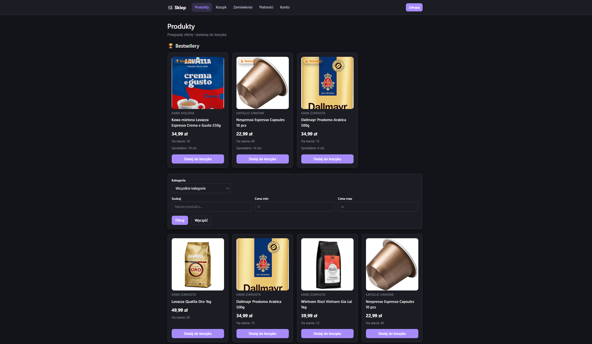
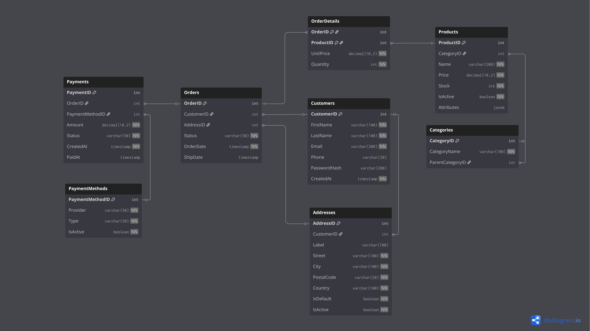

<h1 align="center">☕ Coffee Shop</h1>

<p align="center">
  A full-stack e-commerce store for coffee, grinders and espresso machines —
  built around a <strong>database-first</strong> PostgreSQL backend.
</p>

<p align="center">
  
  
  
  
  
  
</p>

<p align="center">
  <strong>Authors:</strong> Hubert Myszka · Michał Nowak
</p>

> 📚 **About this project**
> This application grew out of a university **Databases** course. The `main` branch holds the
> complete coffee-shop app described below. On the **`lab-x`** branches you'll find our solutions
> to the individual problems set by the instructor, each exploring a different database engine and
> a different set of techniques.

---

<p align="center">
  
</p>

## Overview

Coffee Shop is a working online store: customers browse a catalogue, filter products by price,
category and attributes, manage delivery addresses, place orders, pay for them and track their
history. What makes it interesting isn't the storefront — it's **where the logic lives**.

Almost all business rules, validation, transactions and reporting are implemented **inside the
database** as PL/pgSQL procedures, functions, views and triggers. The Spring Boot backend is a thin
layer that calls these objects and exposes them over a REST API; the React frontend consumes it.

### Why database-first?

| Benefit                             | How we get it                                                                                                                                   |
| ----------------------------------- | ----------------------------------------------------------------------------------------------------------------------------------------------- |
| **Consistency across every client** | The same rules apply whether a request comes from the REST API, a `psql` console or a test — they can't be bypassed by taking a different path. |
| **Atomicity**                       | Multi-step operations (e.g. paying for an order) run inside a single database transaction.                                                      |
| **Performance**                     | Validation and aggregation happen next to the data, with no round-trips to the application.                                                     |

Hibernate runs in `ddl-auto=validate` mode — the ORM **never** generates the schema. SQL scripts own
the schema; Hibernate only checks that the Java entities still match the real tables.

---

## ✨ Highlights

A few details we're proud of:

- 🔒 **No overselling, ever.** Paying for the last unit in stock under concurrent requests is handled
  with row-level `SELECT … FOR UPDATE` locks. A dedicated concurrency test fires two parallel
  payments at the last item and asserts exactly one succeeds. _(see [Transactions & concurrency](#-transactions--concurrency))_
- 🌳 **Recursive category tree.** Categories are self-referencing and traversed with a
  `WITH RECURSIVE` CTE, so filtering by a parent category transparently includes every descendant.
- 🧩 **Schemaless product attributes.** Each category needs different fields (roast level for coffee,
  pressure for espresso machines), so attributes live in a `jsonb` column and are queried with the
  `@>` containment operator — flexibility without an EAV mess.
- 🔄 **Order state machine in a trigger.** Status transitions (`pending → packed → delivered`,
  cancellations, etc.) are validated by a trigger that rejects illegal moves.
- ♻️ **Self-healing stock.** Cancelling a packed order automatically restores the reserved stock via
  an `AFTER UPDATE` trigger — no application code involved.
- 🗂️ **Soft deletes + views.** Products, addresses and payment methods are deactivated, never deleted,
  so historical orders stay intact. `vw_active_*` views hide the inactive rows from the rest of the code.
- 💸 **Historical prices.** `OrderDetails.UnitPrice` freezes the price at purchase time, immune to
  later price changes.
- 🛡️ **Guard procedures.** Reusable `p_check_*` procedures are the single source of truth for each
  invariant, called from the bigger operations instead of being copy-pasted around.

---

## 🗄️ Database schema

<p align="center">
  
</p>

The full ER diagram (PDF) and its dbdiagram.io source live in [`db/erd/`](db/erd).

---

## ⚙️ How the database works

All database objects are loaded automatically on container start from [`db/init/`](db/init), in order:

| File                | Contents                       |
| ------------------- | ------------------------------ |
| `01_schema.sql`     | tables, primary & foreign keys |
| `02_views.sql`      | active-row views               |
| `03_procedures.sql` | stored procedures (writes)     |
| `04_functions.sql`  | functions (reads & reports)    |
| `05_triggers.sql`   | triggers (invariants)          |
| `06_data.sql`       | seed data                      |

The project deliberately exercises three classes of operation:

**Simple CRUD** — adding/updating/deactivating products, editing price and stock, managing
addresses, registering and updating customers, reading catalogue, orders and payments. Implemented as
`p_add_*` / `p_set_*` / `p_deactivate_*` procedures and `f_get_*` functions + views.

**Complex transactional operations** — `p_create_order` builds a whole order from a `jsonb` array of
items in one call; `p_pay_order` validates the order, decrements stock for every item under a row
lock, flips the status and inserts the payment **atomically**; a trigger restores stock when a packed
order is cancelled.

**Reporting** — `f_report_best_sellers` and `f_report_revenue_by_category` aggregate sales with
`JOIN`, `GROUP BY`, `SUM`, recursive CTEs and `LEFT JOIN`; `f_get_customer_expenses` totals a
customer's completed payments.

### 🔐 Transactions & concurrency

The heart of the project is controlling access to a _limited resource_ — product stock.

Picture two customers paying for the last unit at the same time. Without protection both reads see
`stock = 1` and both writes drop it to `0`/`-1` — an oversell. The fix lives in `p_update_stock`:

```sql
SELECT stock INTO v_stock
FROM products
WHERE productid = f_product_id
FOR UPDATE;                       -- row lock held until the transaction ends

IF v_stock + quantity < 0 THEN
    RAISE EXCEPTION 'Stock cannot be negative';
END IF;
```

`FOR UPDATE` takes a **row-level** lock on just that product. The second transaction waits for the
first to commit, then sees the already-decremented stock and its own check correctly rejects it.
Because the lock is per-row (not per-table), payments for _different_ products never block each
other. If any step fails the whole transaction is rolled back — no orphaned payment, no half-applied
stock. `StockConcurrencyTest` proves it: of two parallel payments for the last item, exactly one
succeeds, the other gets `Stock cannot be negative`, and the final stock is `0`.

### Calling it from the app

The backend doesn't duplicate any of this — Spring Data repositories call the database objects with
native SQL:

```java
// state-changing procedure
@Modifying @Transactional
@Query(value = "CALL p_create_order(:customerId, :addressId, CAST(:items AS jsonb))", nativeQuery = true)
void createOrder(@Param("customerId") Integer customerId,
                 @Param("addressId") Integer addressId,
                 @Param("items") String items);

// table-returning report function
@Query(value = "SELECT * FROM f_report_best_sellers(:limit, :categoryId)", nativeQuery = true)
List<Object[]> findBestSellers(@Param("limit") Integer limit, @Param("categoryId") Integer categoryId);
```

---

## 🧱 Tech stack

| Layer           | Technology                                                           |
| --------------- | -------------------------------------------------------------------- |
| Database        | PostgreSQL 16, PL/pgSQL                                              |
| Backend         | Java 25, Spring Boot 4 (Web MVC, Spring Data JPA), Hibernate, Lombok |
| Security        | Spring Security Crypto (BCrypt password hashing)                     |
| Frontend        | React 19, TypeScript, Vite, React Router 7                           |
| Infra & tooling | Docker Compose, Maven, Postman                                       |

---

## 📂 Project structure

```
.
├── docker-compose.yml          # PostgreSQL 16 container
├── db/
│   ├── init/                   # schema, views, procedures, functions, triggers, seed (01–06)
│   └── erd/                    # ER diagram (PDF + dbdiagram.io source)
├── backend/                    # Spring Boot (Java 25, Maven)
│   └── src/main/java/.../backend
│       ├── entity/             # JPA entities (table mappings)
│       ├── repository/         # repositories — CALL / SELECT on DB objects
│       ├── service/            # thin service layer
│       ├── web/                # REST controllers
│       ├── dto/                # transfer objects
│       └── config/             # password & exception config
├── frontend/                   # React 19 + TypeScript + Vite
└── Postman_Collection.json     # sample API requests
```

---

## 🚀 Getting started

### Prerequisites

- Docker + Docker Compose
- JDK 25
- Node.js

### 1. Database

From the project root:

```bash
docker compose up -d
```

This starts PostgreSQL 16 on port **5432** (db `shopdb`, user `shopuser`, password `shoppassword`)
and automatically runs every script in `db/init/` (schema, views, procedures, functions, triggers,
seed data).

> Init scripts only run the **first** time the volume is created. To rebuild the database from scratch:
>
> ```bash
> docker compose down -v && docker compose up -d
> ```

### 2. Backend

```bash
cd backend
./mvnw spring-boot:run        # Windows: mvnw.cmd spring-boot:run
```

The API starts on **http://localhost:8080**. Connection settings are in
`backend/src/main/resources/application.properties` (matching `docker-compose.yml`). Hibernate runs in
`validate` mode, so the database must already be initialised by the scripts.

### 3. Frontend

```bash
cd frontend
npm install
npm run dev
```

The app is served at the URL Vite prints (default **http://localhost:5173**).

### 4. Try the API

Import `Postman_Collection.json` into Postman and set the `baseUrl` variable to
`http://localhost:8080`.

---

## 🧪 Tests

Integration tests in `backend/src/test` run against a real database:

- **`BackendApplicationTest`** — verifies the connection and that every table exists.
- **`DatabaseOperationsTest`** — stock decrement on payment, rejection on insufficient stock,
  best-seller report correctness (ignoring unpaid orders), and blocking an order placed on someone
  else's address.
- **`StockConcurrencyTest`** — the concurrency test described above: two parallel payments for the
  last unit, exactly one wins, no overselling.

```bash
cd backend && ./mvnw test     # requires a running database
```
