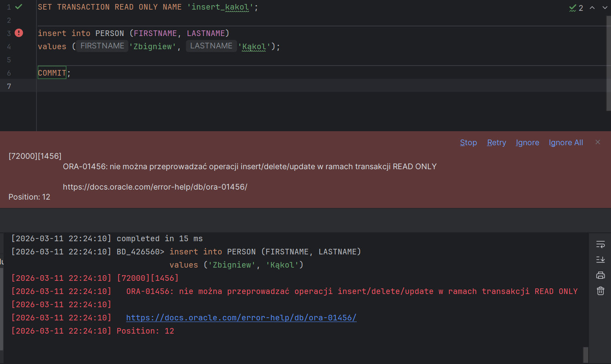

# PostgreSQL PL/pgSQL

widoki, funkcje, procedury, triggery
ćwiczenie

---

Imiona i nazwiska autorów : Hubert Myszka, Michał Nowak

---

<style>
  {
    font-size: 16pt;
  }
</style>

<style scoped>
 li, p {
    font-size: 14pt;
  }
</style>

<style scoped>
 pre {
    font-size: 10pt;
  }
</style>

# Tabele


- `Trip` - wycieczki
  - `trip_id` - identyfikator, klucz główny
  - `trip_name` - nazwa wycieczki
  - `country` - nazwa kraju
  - `trip_date` - data
  - `max_no_places` - maksymalna liczba miejsc na wycieczkę
- `Person` - osoby
  - `person_id` - identyfikator, klucz główny
  - `firstname` - imię
  - `lastname` - nazwisko

- `Reservation` - rezerwacje/bilety na wycieczkę
  - `reservation_id` - identyfikator, klucz główny
  - `trip_id` - identyfikator wycieczki
  - `person_id` - identyfikator osoby
  - `status` - status rezerwacji
    - `N` – New - Nowa
    - `P` – Confirmed and Paid – Potwierdzona  i zapłacona
    - `C` – Canceled - Anulowana
- `Log` - dziennik zmian statusów rezerwacji
  - `log_id` - identyfikator, klucz główny
  - `reservation_id` - identyfikator rezerwacji
  - `log_date` - data zmiany
  - `status` - status

```sql
BEGIN;

create table person
(
    person_id int
        generated always
            as identity
                primary key,
    firstname varchar(50),
    lastname varchar(50)
);

create table trip
(
    trip_id int
        generated always
            as identity
                primary key,
    trip_name varchar(100),
    country varchar(50),
    trip_date date,
    max_no_places int
);

create table reservation
(
    reservation_id int
        generated always
            as identity
                primary key,
    trip_id int not null ,
    person_id int not null ,
    status char(1)
);

alter table reservation
add constraint reservation_fk1 foreign key
(person_id) references person (person_id);

alter table reservation
add constraint reservation_fk2 foreign key
(trip_id) references trip (trip_id);

alter table reservation
add constraint reservation_chk1 check
(status in ('N', 'P', 'C'));

create table log
(
    log_id int
        generated always
            as identity
                primary key,
    reservation_id int not null,
    log_date date not null,
    status char(1)
);

alter table log
add constraint log_fk1 foreign key
(reservation_id) references reservation (reservation_id);

alter table log
add constraint log_chk1 check
(status in ('N', 'P', 'C'));

COMMIT;
```

---

# Dane

Należy wypełnić tabele przykładowymi danymi

- 4 wycieczki
- 10 osób
- 10 rezerwacji

Dane testowe powinny być różnorodne (wycieczki w przyszłości, wycieczki w przeszłości, rezerwacje o różnym statusie itp.) tak, żeby umożliwić testowanie napisanych procedur.

W razie potrzeby należy zmodyfikować dane tak żeby przetestować różne przypadki.

```sql
-- trip
insert into trip(trip_name, country, trip_date, max_no_places)
values ('Wycieczka do Paryza', 'Francja', to_date('2023-09-12', 'YYYY-MM-DD'), 3);

insert into trip(trip_name, country, trip_date,  max_no_places)
values ('Piekny Krakow', 'Polska', to_date('2025-05-03','YYYY-MM-DD'), 2);

insert into trip(trip_name, country, trip_date,  max_no_places)
values ('Znow do Francji', 'Francja', to_date('2025-05-01','YYYY-MM-DD'), 2);

insert into trip(trip_name, country, trip_date,  max_no_places)
values ('Hel', 'Polska', to_date('2025-05-01','YYYY-MM-DD'),  2);

-- person
insert into person(firstname, lastname)
values ('Jan', 'Nowak');

insert into person(firstname, lastname)
values ('Jan', 'Kowalski');

insert into person(firstname, lastname)
values ('Jan', 'Nowakowski');

insert into person(firstname, lastname)
values  ('Novak', 'Nowak');

-- reservation
-- trip1
insert  into reservation(trip_id, person_id, status)
values (1, 1, 'P');

insert into reservation(trip_id, person_id, status)
values (1, 2, 'N');

-- trip 2
insert into reservation(trip_id, person_id, status)
values (2, 1, 'P');

insert into reservation(trip_id, person_id, status)
values (2, 4, 'C');

-- trip 3
insert into reservation(trip_id, person_id, status)
values (2, 4, 'P');
```

proszę pamiętać o zatwierdzeniu transakcji

---

# Zadanie 0 - modyfikacja danych, transakcje

Należy przeprowadzić kilka eksperymentów związanych ze wstawianiem, modyfikacją i usuwaniem danych
oraz wykorzystaniem transakcji

Skomentuj dzialanie transakcji. Jak działa polecenie `commit`, `rollback`?.
Co się dzieje w przypadku wystąpienia błędów podczas wykonywania transakcji? Porównaj sposób programowania operacji wykorzystujących transakcje w PostgreSQL PL/pgSQL ze znanym ci systemem/językiem OracleSQL PL/SQL.

```sql

BEGIN;
set transaction read write;

insert into person(firstname, lastname)
values ('Leszek', 'Kotulski');

insert into person(firstname, lastname)
values ('Student', 'Informatyk');

COMMIT;

BEGIN;
set transaction read write;

insert into person (firstname, lastname)
values ('Zbigniew', 'Stonoga');

ROLLBACK;

-- Wynik:
-- 11,Marcin,Kuta
-- 12,Student,Informatyk

-------------


BEGIN;
set transaction read write;

delete from person
where firstname = 'Student'
and   lastname = 'Informatyk';

COMMIT;

-- Efektem jest pozbycie się wiersza:
-- 12,Student,Informatyk

-------------


BEGIN;
set transaction read only;

insert into person(firstname, lastname)
values ('Zbigniew', 'Stonoga');

COMMIT;

-- Po uruchomieniu tej transakcji wyskoczył błąd:
```



```sql

ROLLBACK;

BEGIN;
set transaction read write;

insert into person(firstname, lastname)
values ('Aleksandra', 'Gorzkowska');

COMMIT;

-- Wynik:
-- 14,Aleksandra,Gorzkowska

-------------


BEGIN;
set transaction read write;

delete from person
where firstname = 'Aleksandra'
and   lastname = 'Gorzkowska';

alter table person
alter column person_id
restart with 12;

insert into person(firstname, lastname)
values ('Aleksandra', 'Gorzkowska');

COMMIT;

-- Wynik:
-- 12,Aleksandra,Gorzkowska

```

---

# Porównanie PostreSQL PL/pgSQL z OracleSQL PL/SQL

### 1 Autocommit

W PostrgeSQL PL/pgSQL występuje autocommit, jednym ze sposobów aby commit nastąpił wtedy kiedy chcemy jest zastosowanie bloku BEGIN; ... COMMIT;. W OracleSQL PL/SQL nie ma autocommit'a.

### 2 Transakcje

W PostgreSQL PL/pgSQL domyślnie nie można nazwać transakcji tak jak to jest w OracleSQL PL/SQL i transakcji można użyć w bloku BEGIN; ... COMMIT;. W OracleSQL PL/SQL transakcja rozpoczyna się od set transaction ..., a nie BEGIN;.

### 3 Tworzenie tabel i sekwencji

W PostgreSQL PL/pgSQL sekwencję odpowiedzialną za ID, która jest PK można stworzyć przez np.:

```sql
person_id int
    generated always
        as identity
            primary key,
```

Przy pomocy przedstawionego sposobu można też stworzyć sekwencję startującą od dowolnej liczby i zwiększającą się o dowolną liczbę np.:

```sql
person int
    generete always
        as (increment by 3 start with 2137)
            primary key,
```

Zamiast tworzyć specjalnie sekwencję tak jak to robiliśmy w OracleSQL PL/SQL. Aby zmienić numer kolejnego ID na 91 można to zrobić poprzez:

```sql
alter table person
    alter column person_id
        restart with 91;
```

Oczywiście można też tworzyć sekwencje tak jak to robiliśmy w OracleSQL PL/SQL, tylko wtedy zamiast odwołania

```sql
alter table person
    modify person_id int default s_person_seq.nextval;
```

robimy

```sql
alter table person
    alter column person_id
        set default nextval('s_person_seq');
```

---

# Zadanie 1 - widoki

Tworzenie widoków. Należy przygotować kilka widoków ułatwiających dostęp do danych. Należy zwrócić uwagę na strukturę kodu (należy unikać powielania kodu)

Widoki:

- `vw_reservation`
  - widok łączy dane z tabel: `trip`, `person`, `reservation`
  - zwracane dane: `reservation_id`, `country`, `trip_date`, `trip_name`, `firstname`, `lastname`, `status`, `trip_id`, `person_id`
- `vw_trip`
  - widok pokazuje liczbę wolnych miejsc na każdą wycieczkę
  - zwracane dane: `trip_id`, `country`, `trip_date`, `trip_name`, `max_no_places`, `no_available_places` (liczba wolnych miejsc)
- `vw_available_trip`
  - podobnie jak w poprzednim punkcie, z tym że widok pokazuje jedynie dostępne wycieczki (takie które są w przyszłości i są na nie wolne miejsca)

Proponowany zestaw widoków można rozbudować wedle uznania/potrzeb

- np. można dodać nowe/pomocnicze widoki, funkcje
- np. można zmienić def. widoków, dodając nowe/potrzebne pola

# Zadanie 1 - rozwiązanie

```sql

--vw_reservation
create or replace view vw_reservation as
    select r.reservation_id,
           t.country,
           t.trip_date,
           t.trip_name,
           p.firstname,
           p.lastname,
           r.status,
           r.trip_id,
           r.person_id
    from reservation r
    inner join trip t on t.trip_id = r.trip_id
    inner join person p on p.person_id = r.person_id;

--vw_trip
create or replace view vw_trip as
    select t.trip_id,
       t.country,
       t.trip_date,
       t.trip_name,
       t.max_no_places,
       t.max_no_places -
       (select count(*)
            from reservation r
            where t.trip_id = r.trip_id
                and r.status in ('N', 'P'))
        as remaining_places
    from trip t;

--vw_available_trip
create or replace view vw_available_trip as
    select *
    from vw_trip
    where remaining_places > 0
    and current_date < trip_date;


-- TEST

select * from vw_reservation;

--RESULT

1,USA,2026-03-01,Chicago,Piotr,Faliszewski,P,1,1
2,Poland,2026-07-01,Warsaw,Robert,Marcjan,N,2,2
3,Poland,2026-07-01,Warsaw,Marcin,Kurdziel,P,2,3
4,Poland,2026-07-01,Warsaw,Marcin,Kuta,C,2,4
5,Poland,2026-01-01,Cracow,Zbigniew,Kąkol,N,3,5
6,Poland,2026-01-01,Cracow,Stanisław,Polak,P,3,6
7,Poland,2026-01-01,Cracow,Radosław,Klimek,C,3,7
8,Germany,2026-08-01,Berlin,Katarzyna,Rycerz,N,4,8
9,Germany,2026-08-01,Berlin,Barbara,Głut,P,4,9
10,Germany,2026-08-01,Berlin,Roman,Dębski,C,4,10


-- TEST

SELECT * FROM vw_trip;

-- RESULT

1,USA,2026-03-01,Chicago,1,0
2,Poland,2026-07-01,Warsaw,10,8
3,Poland,2026-01-01,Cracow,6,4
4,Germany,2026-08-01,Berlin,7,5


-- TEST

select * from vw_available_trip;

-- RESULT

2,Poland,2026-07-01,Warsaw,10,8
4,Germany,2026-08-01,Berlin,7,5


```

---

# Zadanie 2 - funkcje

Tworzenie funkcji pobierających dane/tabele. Podobnie jak w poprzednim przykładzie należy przygotować kilka funkcji ułatwiających dostęp do danych

Procedury:

- `f_trip_participants`
  - zadaniem funkcji jest zwrócenie listy uczestników wskazanej wycieczki
  - parametry funkcji: `trip_id`
  - funkcja zwraca podobny zestaw danych jak widok `vw_reservation`
- `f_person_reservations`
  - zadaniem funkcji jest zwrócenie listy rezerwacji danej osoby
  - parametry funkcji: `person_id`
  - funkcja zwraca podobny zestaw danych jak widok `vw_reservation`
- `f_available_trips_to`
  - zadaniem funkcji jest zwrócenie listy wycieczek do wskazanego kraju, dostępnych w zadanym okresie czasu (od `date_from` do `date_to`)
    - dostępnych czyli takich na które są wolne miejsca
  - parametry funkcji: `country`, `date_from`, `date_to`

Funkcje powinny zwracać tabelę/zbiór wynikowy. Należy rozważyć dodanie kontroli parametrów, (np. jeśli parametrem jest `trip_id` to można sprawdzić czy taka wycieczka istnieje). Podobnie jak w przypadku widoków należy zwrócić uwagę na strukturę kodu

Czy kontrola parametrów w przypadku funkcji ma sens?

- jakie są zalety/wady takiego rozwiązania?

Proponowany zestaw funkcji można rozbudować wedle uznania/potrzeb

- np. można dodać nowe/pomocnicze funkcje/procedury

# Zadanie 2 - rozwiązanie

```sql

-- pomocnicze

-- f_person_exist
create or replace function f_person_exist(p_person_id int)
returns void as $$
    begin
        if not exists(select 1
                      from person
                      where person_id = p_person_id) then
            raise exception 'Person with ID % does not exist!', p_person_id;
        end if;
    end;
$$ language plpgsql;

-- f_trip_exist
create or replace function f_trip_exist(p_trip_id int)
returns void as $$
    begin
        if not exists (select 1
                       from vw_trip
                       where trip_id = p_trip_id) then
            raise exception 'Trip with ID % does not exist!', p_trip_id;
        end if;
    end;
$$ language plpgsql;

-- f_available_trip_exist
create or replace function f_available_trip_exist(p_trip_id int)
returns void as $$
    begin
        if not exists(select 1
                      from vw_available_trip
                      where trip_id = p_trip_id) then
            raise exception 'Trip with ID % is no longer available!', p_trip_id;
        end if;
    end;
$$ language plpgsql;

-- f_reservation_exist
create or replace function f_reservation_exist(p_reservation_id int)
returns void as $$
    begin
        if not exists(select 1
                      from reservation
                      where reservation_id = p_reservation_id) then
            raise exception 'Reservation with ID % does not exist!', p_reservation_id;
        end if;
    end;
$$ language plpgsql;

---------------------------

-- f_person_reservations
create or replace function f_person_reservations (f_person_id int)
returns setof vw_reservation as $$
    begin
        perform f_person_exist(f_person_id);

        return query
        select * from vw_reservation
        where person_id = f_person_id;
    end;
$$ language plpgsql;

-- f_trip_participants
create or replace function f_trip_participants (f_trip_id int)
returns setof vw_reservation as $$
    begin
        perform f_trip_exist(f_trip_id);

        return query
        select * from vw_reservation
        where trip_id = f_trip_id;
    end;
$$ language plpgsql;

-- f_available_trips_to
create or replace function f_available_trips_to
    (f_country varchar, f_date_from date, f_date_to date)
returns setof vw_trip as $$
    begin
        if f_date_from > f_date_to then
            raise exception 'Start date (%) cannot be later than end date (%)!', f_date_from, f_date_to;
        end if;

        return query
        select * from vw_trip
        where country = f_country
            and remaining_places > 0
            and trip_date between f_date_from and f_date_to;
    end;
$$ language plpgsql;

-- TEST

select * from f_trip_participants(3);

--RESULT

5,Poland,2026-01-01,Cracow,Zbigniew,Kąkol,N,3,5
6,Poland,2026-01-01,Cracow,Stanisław,Polak,P,3,6
7,Poland,2026-01-01,Cracow,Radosław,Klimek,C,3,7


-- TEST

select * from f_person_reservations(4);

-- RESULT

4,Poland,2026-07-01,Warsaw,Marcin,Kuta,C,2,4


-- TEST

select * from f_available_trips_to('Poland', '2025-01-01', '2027-01-01');

-- RESULT

2,Poland,2026-07-01,Warsaw,10,8
3,Poland,2026-01-01,Cracow,6,4


```

---

# Zadanie 3 - procedury

Tworzenie procedur modyfikujących dane. Należy przygotować zestaw procedur pozwalających na modyfikację danych oraz kontrolę poprawności ich wprowadzania

Procedury

- `p_add_reservation`
  - zadaniem procedury jest dopisanie nowej rezerwacji
  - parametry: `trip_id`, `person_id`
  - procedura powinna kontrolować czy wycieczka jeszcze się nie odbyła, i czy sa wolne miejsca
  - procedura powinna również dopisywać inf. do tabeli `log`
- `p_modify_reservation_status`
  - zadaniem procedury jest zmiana statusu rezerwacji
  - parametry: `reservation_id`, `status`
  - dopuszczalne są wszystkie zmiany statusu
    - ale procedura powinna kontrolować czy taka zmiana jest możliwa, np. zmiana statusu już anulowanej wycieczki (przywrócenie do stanu aktywnego nie zawsze jest możliwa – może już nie być miejsc)
  - procedura powinna również dopisywać inf. do tabeli `log`
- `p_modify_max_no_places`
  - zadaniem procedury jest zmiana maksymalnej liczby miejsc na daną wycieczkę
  - parametry: `trip_id`, `max_no_places`
  - nie wszystkie zmiany liczby miejsc są dozwolone, nie można zmniejszyć liczby miejsc na wartość poniżej liczby zarezerwowanych miejsc

Należy rozważyć użycie transakcji

- czy należy użyć `commit` wewnątrz procedury w celu zatwierdzenia transakcji
  - jakie są tego konsekwencje

Należy zwrócić uwagę na kontrolę parametrów (np. jeśli parametrem jest trip_id to należy sprawdzić czy taka wycieczka istnieje, jeśli robimy rezerwację to należy sprawdzać czy są wolne miejsca itp..)

Proponowany zestaw procedur można rozbudować wedle uznania/potrzeb

- np. można dodać nowe/pomocnicze funkcje/procedury

# Zadanie 3 - rozwiązanie

```sql

-- p_add_reservation
create or replace procedure p_add_reservation
(p_trip_id int, p_person_id int)
as $$
    declare
        v_reservation_id int;
    begin
        perform f_trip_exist(p_trip_id);
        perform f_person_exist(p_person_id);
        perform * from trip where trip_id = p_trip_id for update;
        perform f_available_trip_exist(p_trip_id);

        if exists (select 1 from reservation
           where trip_id = p_trip_id
            and person_id = p_person_id
            and status != 'C')
            then raise exception
            'Person % already has an active reservation for trip %',
            p_person_id, p_trip_id;
        end if;

        insert into reservation (trip_id, person_id, status)
        values (p_trip_id, p_person_id, 'N')
        returning reservation_id into v_reservation_id;

        insert into log (reservation_id, log_date, status)
        values (v_reservation_id, current_date, 'N');

        raise notice 'Success: Reservation % created for person %.',
        v_reservation_id, p_person_id;
    end;
$$ language plpgsql;

-- p_modify_reservation_status
create or replace procedure p_modify_reservation_status
(p_reservation_id int, p_status char(1))
as $$
    declare
        v_old_status char(1);
        v_trip_id int;
    begin
        perform f_reservation_exist(p_reservation_id);

        select status, trip_id into v_old_status, v_trip_id
        from reservation
        where reservation_id = p_reservation_id
        for update;

        if v_old_status = p_status
            then raise exception
            'Reservation % already has status %!',
            p_reservation_id, p_status;
        end if;

        if v_old_status = 'C' and p_status in ('N', 'P') then
            perform * from trip where trip_id = v_trip_id for update;
            perform f_available_trip_exist(v_trip_id);
        end if;

        update reservation
        set status = p_status
        where reservation_id = p_reservation_id;

        insert into log (reservation_id, log_date, status)
        values (p_reservation_id, current_date, p_status);
    end;
$$ language plpgsql;

-- p_modify_max_no_places
create or replace procedure p_modify_reservation_status
(p_reservation_id int, p_status char(1))
as $$
    declare
        v_old_status char(1);
        v_trip_id int;
    begin
        perform f_reservation_exist(p_reservation_id);

        select status, trip_id into v_old_status, v_trip_id
        from reservation
        where reservation_id = p_reservation_id
        for update;

        if v_old_status = p_status
            then raise exception
            'Reservation % already has status %!',
            p_reservation_id, p_status;
        end if;

        if v_old_status = 'C' and p_status in ('N', 'P') then
            perform * from trip where trip_id = v_trip_id for update;
            perform f_available_trip_exist(v_trip_id);
        end if;

        update reservation
        set status = p_status
        where reservation_id = p_reservation_id;

        insert into log (reservation_id, log_date, status)
        values (p_reservation_id, current_date, p_status);

        raise notice
        'Success: Status of reservation % changed from % to %',
        p_reservation_id, v_old_status, p_status;
    end;
$$ language plpgsql;

-- TEST

call p_add_reservation(4, 2);

--RESULT

Success: Reservation 11 created for person 2.


-- TEST

call p_modify_reservation_status(2, 'P');

-- RESULT

Success: Status of reservation 2 changed from N to P


-- TEST

call p_modify_max_no_places(2, 9);

-- RESULT

Success: Max places for trip 2 updated to 9.

```

---

# Zadanie 4 - triggery

Zmiana strategii zapisywania do dziennika rezerwacji. Realizacja przy pomocy triggerów

Należy wprowadzić zmianę, która spowoduje, że zapis do dziennika będzie realizowany przy pomocy trigerów

Triggery:

- trigger/triggery obsługujące
  - dodanie rezerwacji
  - zmianę statusu
- trigger zabraniający usunięcia rezerwacji

Oczywiście po wprowadzeniu tej zmiany należy "uaktualnić" procedury modyfikujące dane.

> UWAGA
> Należy stworzyć nowe wersje tych procedur (dodając do nazwy dopisek 4 - od numeru zadania). Poprzednie wersje procedur należy pozostawić w celu umożliwienia weryfikacji ich poprawności

Należy przygotować procedury: `p_add_reservation_4`, `p_modify_reservation_status_4` , `p_modify_reservation_4`

# Zadanie 4 - rozwiązanie

```sql

-- t_add_reservation

create or replace trigger t_add_reservation
    after insert
    on reservation
    for each row
begin
    INSERT INTO log(reservation_id, log_date, status)
    VALUES (:NEW.reservation_id, TRUNC(SYSDATE), :NEW.status);
end;


-- t_changed_reservation_status

create or replace trigger t_changed_reservation_status
    after update of status
    on reservation
    for each row
begin
    if :old.status != :new.status then
        INSERT INTO log(reservation_id, log_date, status)
        VALUES (:NEW.reservation_id, TRUNC(SYSDATE), :NEW.status);
    end if;
end;


-- t_prevent_reservation_delete

create or replace trigger t_prevent_reservation_delete
    before delete
    on reservation
    for each row
begin
    RAISE_APPLICATION_ERROR(-20008, 'Deleting reservations is forbidden!');
end;


----------------------

-- p_add_reservation_4

create or replace procedure p_add_reservation_4(vtrip_id int, vperson_id int)
as
    existing_reservation int;
    vreservation_id      INT;
begin
    p_person_exist(vperson_id);
    p_av_trip_exist(vtrip_id);

    SELECT COUNT(*)
    INTO existing_reservation
    FROM reservation r
    WHERE r.trip_id = vtrip_id
      AND r.person_id = vperson_id
      AND r.status IN ('N', 'P');

    IF existing_reservation > 0 THEN
        RAISE_APPLICATION_ERROR(-20004, 'This reservation already exists!');
    END IF;

    insert into reservation(trip_id, person_id, status)
    values (vtrip_id, vperson_id, 'N')
    returning reservation_id into vreservation_id;
end;


-- p_modify_reservation_status4

create or replace procedure p_modify_reservation_status_4(vreservation_id int, vstatus char)
as
    vold_status reservation.status%TYPE;
    vtrip_id    reservation.trip_id%TYPE;
    vexists     int;
begin
    p_reservation_exist(vreservation_id);
    IF vstatus NOT IN ('N', 'P', 'C') THEN
        RAISE_APPLICATION_ERROR(-20005, 'Invalid reservation status!');
    END IF;

    SELECT STATUS, TRIP_ID
    into vold_status, vtrip_id
    FROM RESERVATION
    WHERE RESERVATION_ID = vreservation_id;


    IF vold_status = 'C' AND (vstatus = 'P' OR vstatus = 'N') THEN
        SELECT COUNT(*)
        INTO vexists
        FROM trip v
        WHERE v.trip_id = vtrip_id;

        IF vexists = 0 THEN
            RAISE_APPLICATION_ERROR(-20006, 'No free places available for this trip!');
        END IF;
    END IF;

    UPDATE reservation
    SET status = vstatus
    WHERE reservation_id = vreservation_id;
end;


-- p_modify_max_no_places4

create or replace procedure p_modify_max_no_places4
(
    p_trip_id in trip.trip_id%type,
    p_max_no_places in trip.max_no_places%type
)
as
    v_reserved_places int;
begin
    p_trip_exist(p_trip_id);

    SELECT COUNT(*)
    INTO v_reserved_places
    FROM reservation
    WHERE trip_id = p_trip_id AND status IN ('P', 'N');

    if p_max_no_places < v_reserved_places
    then RAISE_APPLICATION_ERROR(-20007, 'The number of places cannot be reduced!');
    end if;

    UPDATE trip
    SET max_no_places = p_max_no_places
    WHERE trip_id = p_trip_id;
end;

-- TEST

CALL p_add_reservation_4(3, 12);
COMMIT;
SELECT * FROM log ORDER BY log_date DESC, log_id DESC;

-- RESULT

43,33,2026-04-14,N


-- TEST

CALL p_modify_reservation_status_4(7, 'C');
COMMIT;
SELECT * FROM log ORDER BY log_date DESC, log_id DESC;

-- RESULT

44,7,2026-04-14,C


-- TEST

DELETE FROM reservation WHERE reservation_id = 1;

-- RESULT

ORA-20008: Deleting reservations is forbidden!
ORA-06512: przy "T_PREVENT_RESERVATION_DELETE", linia 2
ORA-04088: błąd w trakcie wykonywania wyzwalacza 'T_PREVENT_RESERVATION_DELETE'

```

---

# Zadanie 5 - triggery

Zmiana strategii kontroli dostępności miejsc. Realizacja przy pomocy triggerów

Należy wprowadzić zmianę, która spowoduje, że kontrola dostępności miejsc na wycieczki (przy dodawaniu nowej rezerwacji, zmianie statusu) będzie realizowana przy pomocy trigerów

Triggery:

- Trigger/triggery obsługujące:
  - dodanie rezerwacji
  - zmianę statusu

Oczywiście po wprowadzeniu tej zmiany należy "uaktualnić" procedury modyfikujące dane.

> UWAGA
> Należy stworzyć nowe wersje tych procedur (np. dodając do nazwy dopisek 5 - od numeru zadania). Poprzednie wersje procedur należy pozostawić w celu umożliwienia weryfikacji ich poprawności.

Należy przygotować procedury: `p_add_reservation_5`, `p_modify_reservation_status_5`, ...

# Zadanie 5 - rozwiązanie

```sql

-- t_before_insert_reservation

create or replace trigger t_before_insert_reservation
    before insert on reservation
    for each row
declare
    vexists INT;
begin
    if :new.status IN ('N', 'P') then
        SELECT COUNT(*)
        INTO vexists
        FROM vw_available_trip v
        WHERE v.trip_id = :new.trip_id;

        if vexists = 0 then
            RAISE_APPLICATION_ERROR(-20006, 'No free places available for this trip!');
        end if;
    end if;

end;


-- t_before_changing_reservation_status

create or replace trigger t_before_changing_reservation_status
    before update of status
    on reservation
    for each row
declare
    vexists INT;
begin

     IF :old.status = 'C' AND (:new.status = 'P' OR :new.status = 'N') THEN
        SELECT COUNT(*)
        INTO vexists
        FROM vw_available_trip v
        WHERE v.trip_id = :new.trip_id;

        IF vexists = 0 THEN
            RAISE_APPLICATION_ERROR(-20006, 'No free places available for this trip!');
        END IF;
    END IF;

end;


-- t_check_max_places

create or replace trigger t_check_max_places
    before update of max_no_places on trip
    for each row
declare
    v_reserved_places int;
begin
    SELECT COUNT(*)
    INTO v_reserved_places
    FROM reservation
    WHERE trip_id = :NEW.trip_id AND status IN ('P', 'N');

    if :NEW.max_no_places < v_reserved_places
        then RAISE_APPLICATION_ERROR(-20007, 'The number of places cannot be reduced!');
    end if;
end;

----------------------


-- p_modify_reservation_status_5

CREATE OR REPLACE PROCEDURE p_modify_reservation_status_5(
    vreservation_id INT,
    vstatus CHAR
) AS
BEGIN
    p_reservation_exist(vreservation_id);

    UPDATE reservation
    SET status = vstatus
    WHERE reservation_id = vreservation_id;
END;

-- p_modify_max_no_places5

create or replace procedure p_modify_max_no_places5
(
    p_trip_id in trip.trip_id%type,
    p_max_no_places in trip.max_no_places%type
)
as
begin
    p_trip_exist(p_trip_id);

    UPDATE trip
    SET max_no_places = p_max_no_places
    WHERE trip_id = p_trip_id;
end;

-- p_add_reservation_5

create or replace procedure p_add_reservation_5(
    vtrip_id INT,
    vperson_id INT
)
as
    existing_reservation INT;
begin
    p_person_exist(vperson_id);
    p_trip_exist(vtrip_id);

    SELECT COUNT(*)
    INTO existing_reservation
    FROM reservation r
    WHERE r.trip_id = vtrip_id
      AND r.person_id = vperson_id
      AND r.status IN ('N', 'P');

    if existing_reservation > 0 then
        RAISE_APPLICATION_ERROR(-20004, 'This reservation already exists!');
    end if;

    INSERT INTO reservation(trip_id, person_id, status)
    VALUES (vtrip_id, vperson_id, 'N');
end;

-- TEST

CALL p_add_reservation_5(1, 13);

-- RESULT

Zakończono pomyślnie

-- TEST

CALL p_modify_reservation_status_5(4, 'P');

-- RESULT

ORA-04091: tabela RESERVATION ulega mutacji, wyzwalacz/funkcja może tego nie widzieć
[2026-04-14 23:42:25] 	ORA-06512: przy "T_BEFORE_CHANGING_RESERVATION_STATUS", linia 6
[2026-04-14 23:42:25] 	ORA-04088: błąd w trakcie wykonywania wyzwalacza 'T_BEFORE_CHANGING_RESERVATION_STATUS'
[2026-04-14 23:42:25] 	ORA-06512: przy "P_MODIFY_RESERVATION_STATUS_5", linia 8


-- TEST

CALL p_modify_max_no_places5(2, 60);
COMMIT;

-- RESULT

Zakończono pomyślnie

```

---

# Zadanie - podsumowanie

Porównaj sposób programowania w systemie PostgreSQL PL/pgSQL ze znanym ci systemem/językiem OracleSQL PL/SQL.
